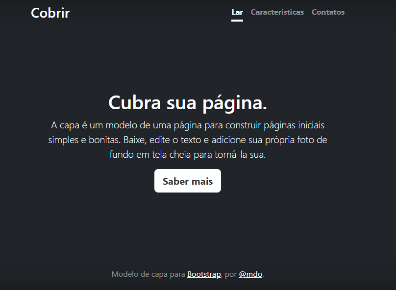

# Índice
[projeto - portifolio para escrita do README](#projeto---portifolio-para-escrita-do-readme)  
[Descrição](#descri%C3%A7%C3%A3o)  
[funcionalidades](#funcionalidades)  
[Tecnologias ultilizadas](#tecnologias-ultilizadas)    
[fontes consultadas](#fontes-consultadas)  
[autores](#autores)  

# Projeto - portifólio para a escrita do README

## 📰Descrição
Vamos explorar o passo a passo para criar um README informativo e completo que ajudará os colaboradores e usuários a entenderem seu projeto. Além disso, vamos introduzir a ferramenta Bootstrap como exemplo de como você pode aprimorar o design da sua documentação e interface do usuário, tornando-a mais atraente e funcional. Aprenda a comunicar claramente a finalidade do seu projeto, como instalá-lo, como usá-lo e como outros podem contribuir, tudo isso enquanto aproveita o poder do Bootstrap para um design elegante e responsivo.  
Aula: Programação Web I  
Professor: Leonardo Santiago Sidon da Rocha   
localização: Marista Social Irmão Acácio   
## ⚙️Funcionalidades

### 📱Tecnologias utilizadas
 
## 🔠Fontes consultadas
 
## ✒️Autores

